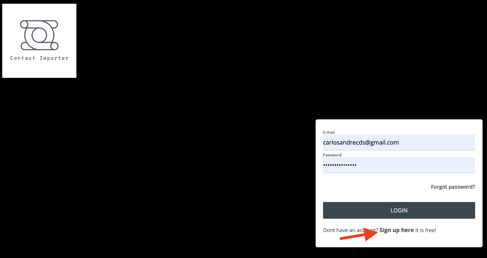
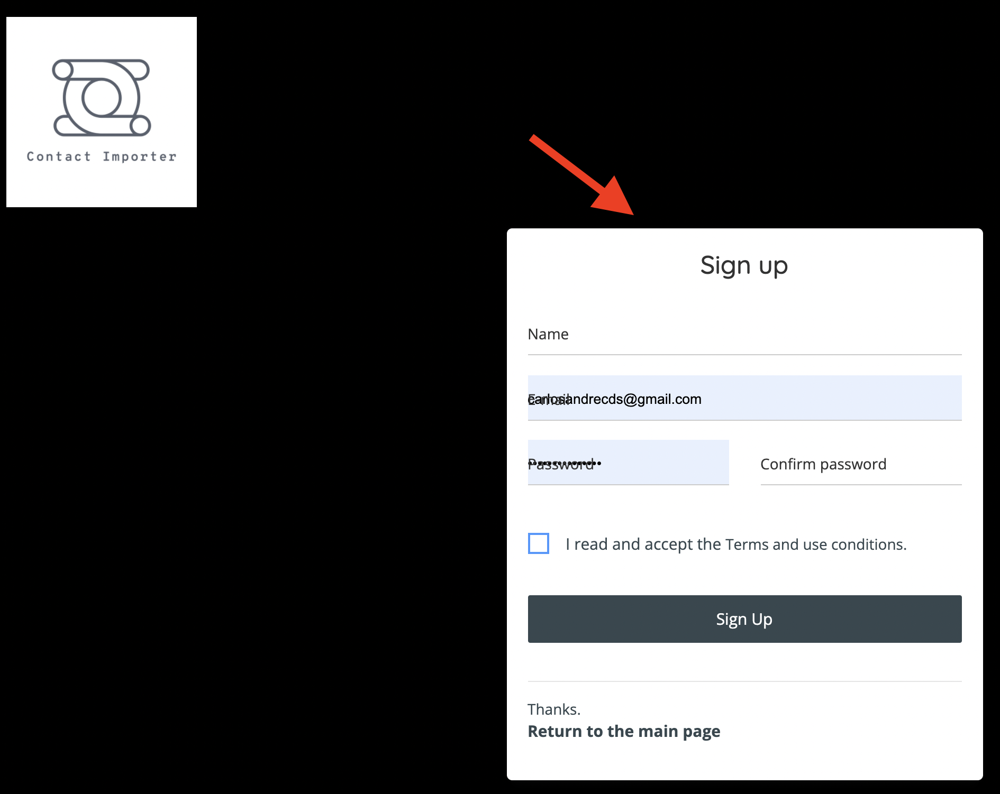
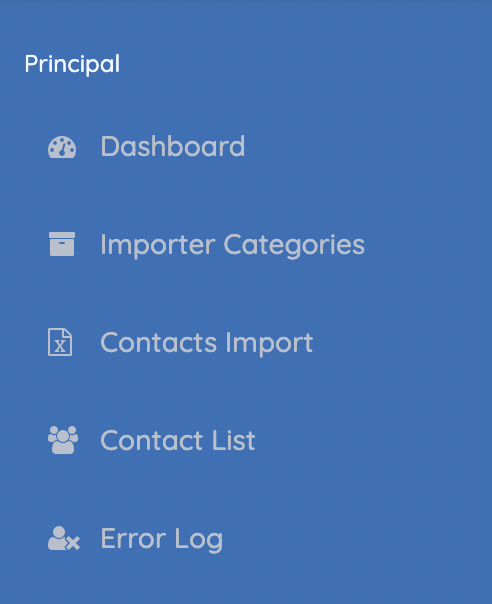
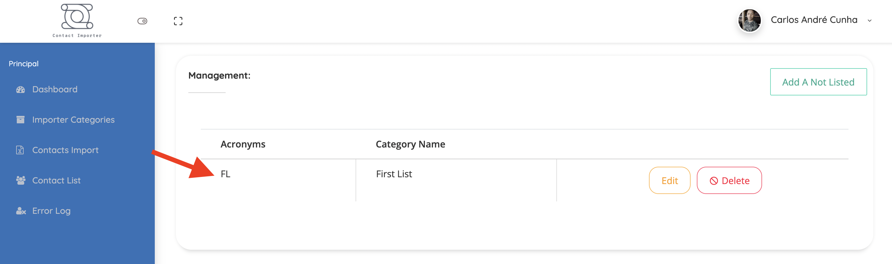
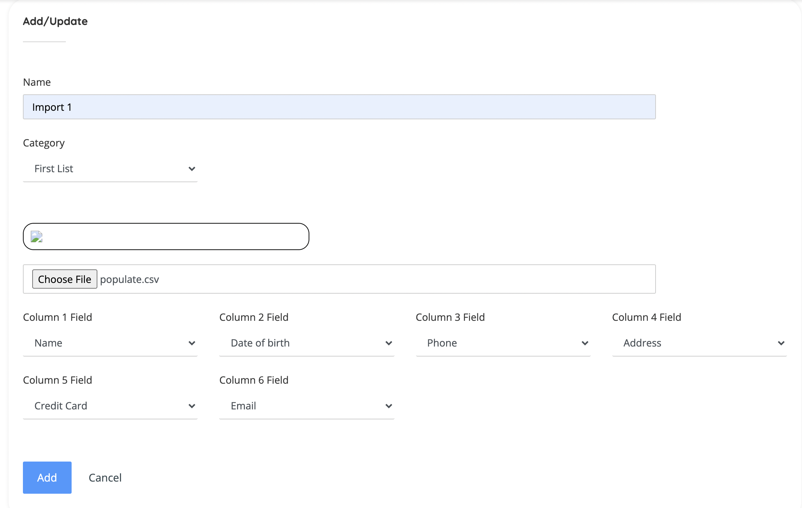

# Contact Importer system 
The system was developed for evaluation purposes. The "Contact importer" platform was created to allow a "CSV" file to be submitted and your contacts to be imported into the system.

Inside the "root" directory of the project there are some files (CSV spreadsheets) that can be used as tests for the required business rules.

Tests can be performed as follows: 

# 1 Creating an account.


1.1. Click in the "Sign up here" and complete the form with your infos to login and use the system






# The menu left bar can be used like:



1.2.1. Dashboard: Use to get stats your imports

1.2.2. Import Categories: Use to give categories to your imports to make easy your life ;)

1.2.3. Contacts import: Use to import your CSV files and to see the list of it;

1.2.4. Contact list: Here you have a list of all your imported contacts, all of them is editable;

1.2.5. Error log: Here you see the contacts from your CSV files that were not imported due to erros in your CSV;


# 2 Running tests: 

2.1. First create a category of imports, by default we already created one for you, but feel free to create as much as you want, this can help you organize yuor routines.



2.2. Now go to the "Contact import" tab to upload your first CSV files and then click in "Add A Not Listed" to add a new one. 

Here we will show you how to access the CSV files, populate the DB and and execute some tests.

2.2.1. First populate the database using the file called "populate.csv" that is in the root directory of the project. Make the upload selecting the file as shows below.

- Give a name
- Select the category 
- Select the file "populate.csv"
- Now select the column fields (These are the headers of each column in your file) in these order: 

    Name

    Date of birth

    Phone 

    Address

    Credit Card

    Email



Click in the "Add" button and then go to the tab called "Contact List" and check the imported contacts

2.2.2. You will notice that some contacts were not imported, This was done on purpose, to show some system filters. Go to the tab "Error log" and then you will have a overview 
of what happened with this registry. In the column "Cause of the error" you can see why this specific contact was not imported.


## 3 Technical Mentions

3.1. The database details for connection is in .ENV file in the root of the system, so you can check:

- Encrypted fields
- Storage of informations


3.2. The CSV files are stored in the folowing path:

web/public/files/samples

___

## Technical stuffs

## Overview

1. [Install prerequisites](#install-prerequisites)

    Before starting make sure you have the prerequisites to start the application.

2. [clone the project](#clone-the-project)

    Download it from the GITHUB repository.

3. [open the application](#run-the-application)

    So far everything is configured to run.

4. [Docker Commands](#use-docker-commands)

    When running, you can use docker commands for doing recurrent operations.

___

## Install prerequisites

To run docker commands without using sudo **sudo** you need to add docker **docker** to the **your-user** group:

```
sudo usermod -aG docker your-user
```

Requisites :

* [Git](https://git-scm.com/downloads)
* [Docker](https://docs.docker.com/engine/installation/)
* [Docker Compose](https://docs.docker.com/compose/install/)

Check with `docker-compose` if everything is properly installed : 

```sh
which docker-compose
```


### Images to use

* [Nginx](https://hub.docker.com/_/nginx/)
* [MySQL](https://hub.docker.com/_/mysql/)
* [PHP-FPM](https://hub.docker.com/r/nanoninja/php-fpm/)
* [Composer](https://hub.docker.com/_/composer/)


The images are using the following ports:

| Server     | Port |
|------------|------|
| MySQL      | 3306 |
| Nginx      | 80   |

___

## Clone the projeto

Use this command :

```sh
git clone git@github.com:carlosandrecds/contact_importer.git
```

Go to the project folder :

```sh
cd contact_importer
```

### Project tree

```sh
.
├── Makefile
├── populate.csv
├── README.md
├── data
│   └── db
│       ├── dumps
│       └── mysql
├── docker-compose.yml
├── etc
│   ├── nginx
│   │   ├── default.conf
│   │   └── default.template.conf
│   ├── php
│   │   └── php.ini
│   └── ssl
└── web
    ├── app
    │   ├── composer.json.dist
    │   ├── phpunit.xml.dist
    │   ├── src
    │   │   └── Foo.php
    │   └── test
    │       ├── FooTest.php
    │       └── bootstrap.php
    └── public
        └── index.php
```

___


## Open the application

1. Start the application :

    ```sh
    docker-compose up -d
    ```

    **Patience, this may take a few minutes...**

    ```sh
    docker-compose logs -f 
    ```

2. Open the project in your favorite browser:

    * [http://localhost:80](http://localhost:80/)

3. To stop the application

    ```sh
    docker-compose down -v
    ```

___

## Help us
With love and carring for the tech team! May the force be you guys. 

carlosandrecds@gmail.com